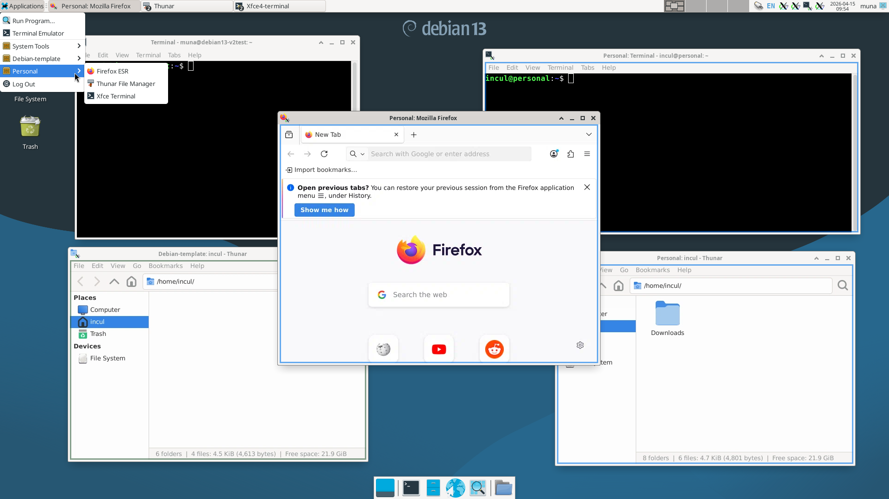
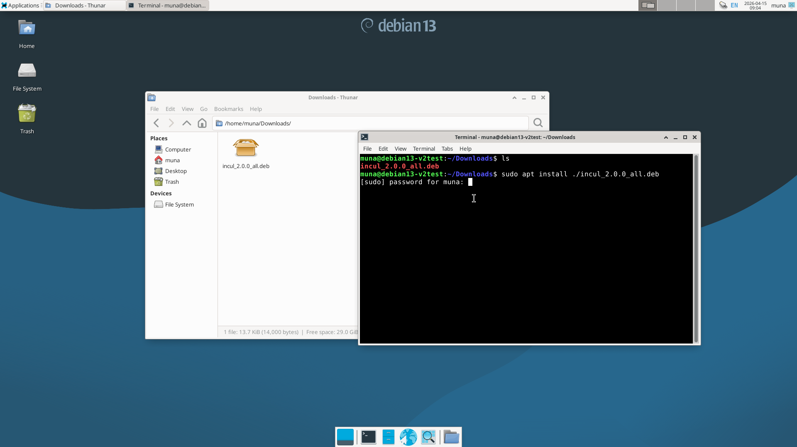
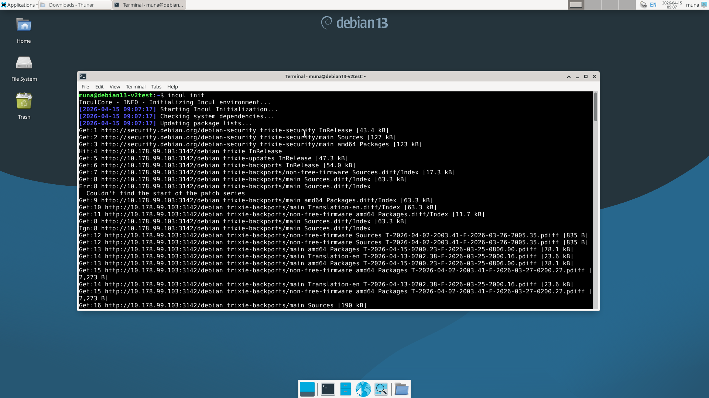
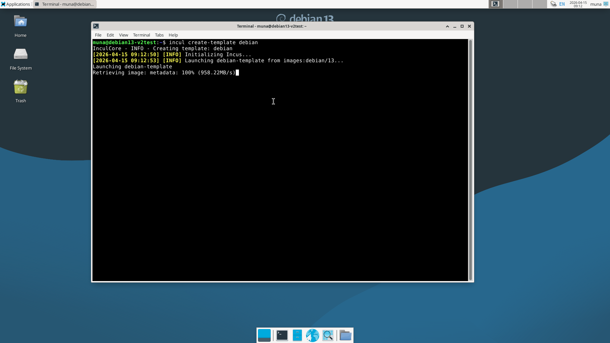
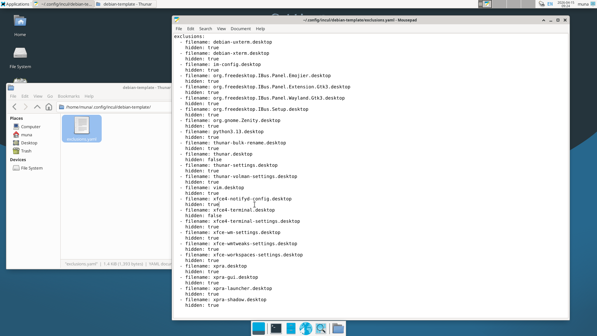
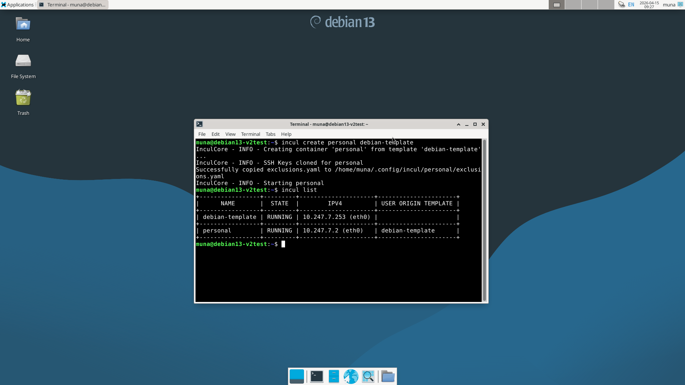
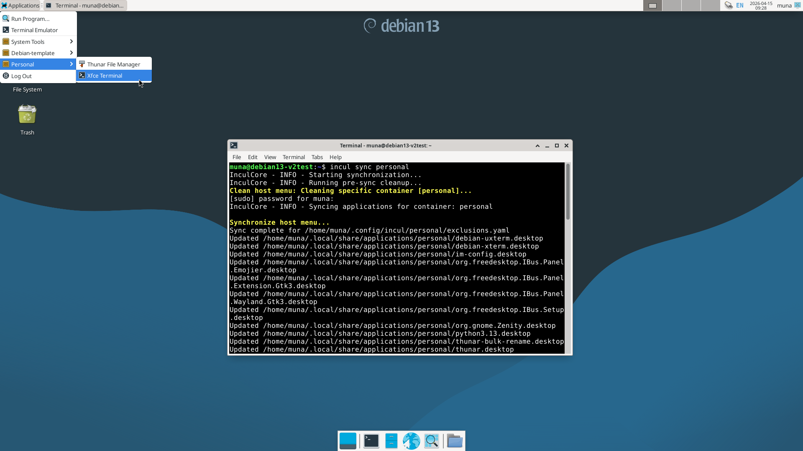
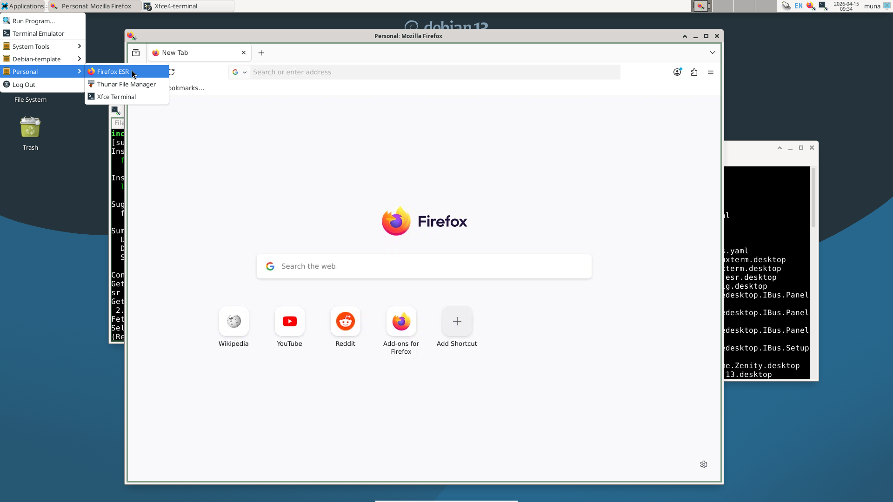

# Incul

**Lightweight container-based desktop compartmentalization.**

Incul leverages Incus and Xpra under the hood to let you run isolated environments for everyday tasks without the overhead of
full virtual machines. You can keep different applications, projects, or libraries neatly compartmentalized, making it easy to
isolate and organize your desktop activities.




## Why Compartmentalization?

Stop cluttering your host OS with every library, tool, and service. Incul promotes a workflow where your projects live in silos:

* **Development:** Spin up dedicated containers for different programming languages or conflicting library versions.
* **Testing:** Run browsers, office, or media tools in isolation.
* **Privacy & Organization:** Separate personal activities and work activities into their own secure containers.

Using **Xpra**, graphical applications inside containers are rendered seamlessly as standard windows on your desktop .


## Getting Started

### Prerequisites
* A fresh installation of **Debian 13 (Trixie)** with the **XFCE** desktop environment.

### Installation
1.  **Install the package:**
    ```bash
    sudo apt install ./incul_2.0.0_all.deb
    ```
    

2.  **Bootstrap the system:**
    This process will configure the necessary backends and will require a **reboot** upon completion.
    ```bash
    incul init
    ```
    

### Basic Workflow
1.  **Create a template:**
    ```bash
    incul create-template debian
    ```
    

    *Note: Incul generates a config for each container in `~/.config/<container_name>`. Use the `exclusions.yaml` file 
    to hide or show specific menu entries on the host.*
    
    


2.  **Launch a container from your template:**
    ```bash
    incul create personal debian-template
    ```
    

3.  **Synchronize the application menu:**
    This integrates the container's apps into your host XFCE menu.
    ```bash
    incul sync personal
    ```
    

4.  **Run applications:**
    Simply select an entry in your host menu under the specific container category.
    

**Default Credentials:**
* **Username:** `incul`
* **Password:** `incul`


## Command Reference

| Action | Example Usage | Explanation |
| :--- | :--- | :--- |
| **list** | `incul list` | List all existing containers. |
| **init** | `incul init` | Bootstrap the Incul system. |
| **start** | `incul start <name>` | Start a container. |
| **pause** | `incul pause <name>` | Pause a running container. |
| **stop** | `incul stop <name>` | Stop a container. |
| **restart** | `incul restart <name>` | Restart a container. |
| **delete** | `incul delete <name>` | Remove a container permanently. |
| **export** | `incul export <name>` | Backup a container to a file. |
| **import** | `incul import <path> --name <new_name>` | Restore a container from backup. |
| **sync** | `incul sync <name>` | Sync container entries to the host menu. |
| **create** | `incul create <name> <template>` | Create a container from a template. |
| **create-template** | `incul create-template <name>` | Create a new base template. |


## Architecture

* **[Incus](https://github.com/lxc/incus):** A modern, secure, and powerful system container and virtual machine manager.
* **[Xpra](https://github.com/Xpra-org/xpra/):** Known as "screen for X." Its seamless mode allows Incul to direct the display of individual X11 programs to your local machine.
* **XFCE Integration:** Incul bridges the gap between Incus containers and the host, ensuring `.desktop` entries are automatically categorized and accessible.


## Feedback & Contributions

Contributions and feedback are highly appreciated! 

[](https://buymeacoffee.com/munabedan)